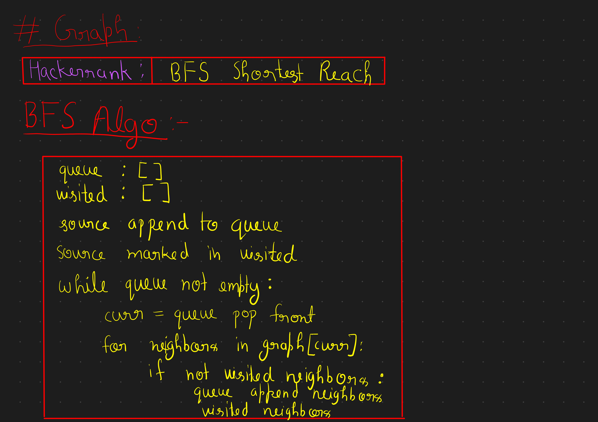

## Graph

<!-- <object data="../../assets/pdfs/posts/notes/akash-verma/01-Two-Pointer/Session-1_September_06-2022.pdf" width="730" height="1000" type='application/pdf'></object> -->

<!-- 

 -->

## Practice Questions

|S.No.|Questions|Platform|Solutions|
|---|---|---|---|
|1. |[Breadth First Search: Shortest Reach](https://www.hackerrank.com/challenges/bfsshortreach/problem)|HackerRank| [Solution]()|
|2. |[403. Frog Jump]()|Leetcode| [Solution]() |

